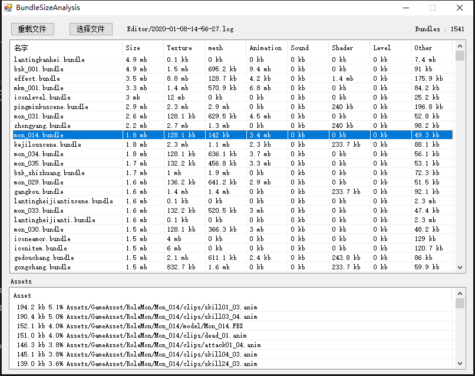

# BundleSizeAnalysis
UNITY BundleSize Analysis

运行程序后会将 Unity 最新的 Editor.log 文件拷贝到 Editor 中备份，备份文件名为 yyyy-MM-dd-HH-mm-ss.log。

* 重载按键: 重新加载 Unity 最新的 Editor.log 文件。
* 选择文件: 选择指定log文件，不会拷贝。
* 文件路径显示
* bundle 个数统计
* bundle 信息显示，可以每列由大到小排序，默认为 Size。
* Assets 信息显示，当前选择的bundle中的资源信息，过滤掉了非资源文件大小。